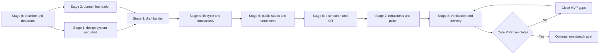
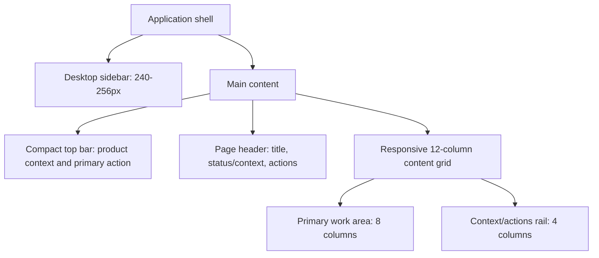
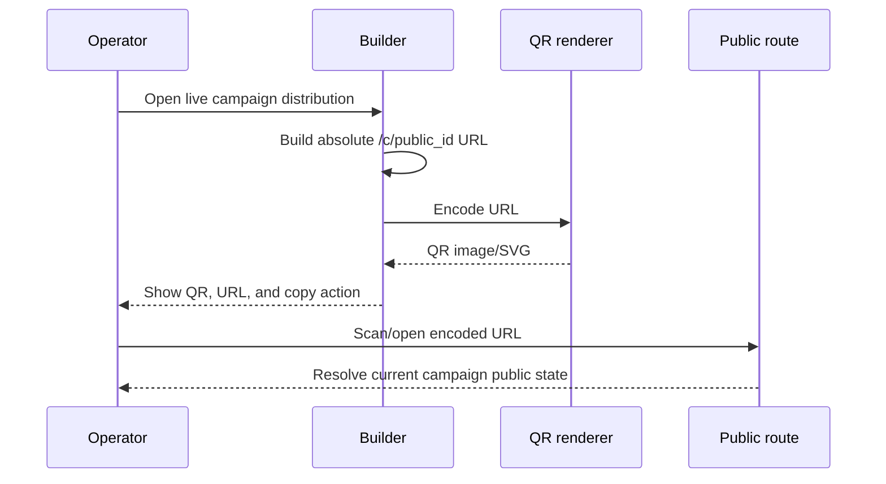

# LoopLink Campaign Builder — Multi-Stage Implementation Plan

This plan converts the assignment into sequenced, reviewable implementation stages for the supplied Django, HTMX, Alpine, and Tailwind starter project.

## 1. Source-of-truth hierarchy

Every implementation decision must follow this order:

1. **Primary and binding:** [`problem-statement.md`](./problem-statement.md). Refer to it whenever a requirement, lifecycle rule, validation rule, workflow, or scope boundary is unclear. The implementation must not contradict it.
2. **Secondary design reference:** [`solution-blueprint.md`](./solution-blueprint.md). Use it for the agreed architecture, workflow interpretation, domain boundaries, routes, data model, concurrency strategy, and diagrams.
3. **Implementation plan:** this document. It determines delivery order and concrete tasks, but it cannot weaken or override either document above.
4. **Code and tests:** executable proof of the first two documents. If tests or current code conflict with the problem statement, correct the code/tests rather than changing the requirement silently.

When doubt remains after consulting both documents, record the assumption in `TECH_NOTES.md`, choose the smallest behavior compatible with the problem statement, and cover it with a test.

## 2. Planning principles

- Deliver the complete must-have MVP before starting a stretch goal.
- Keep status as the only authority for public visibility and enrollment. Dates never auto-transition a campaign.
- Enforce validation, draft locking, lifecycle actions, stale-write protection, and enrollment uniqueness on the server.
- Build the internal builder and shopper page as separate representations over the same domain model.
- Use the starter stack as intended: Django templates for rendering, HTMX for targeted interactions, Alpine only for local UI behavior, and Tailwind for the design system.
- Prefer one cohesive vertical feature app over unnecessary infrastructure within the assignment timebox.
- Make each stage independently testable and commit it as a coherent unit.
- Treat usability states—empty, loading, validation, error, locked, invalid link, non-live, and duplicate enrollment—as product requirements.

## 3. Proposed implementation shape

Use one feature-focused Django app so domain and delivery code stay easy to navigate while retaining clear internal boundaries.

```text
looplink-starter-project-main/
├── looplink/
│   ├── campaigns/
│   │   ├── migrations/
│   │   ├── services/
│   │   │   ├── campaign_lifecycle.py
│   │   │   ├── campaign_writes.py
│   │   │   ├── enrollment.py
│   │   │   └── identity.py
│   │   ├── templates/campaigns/
│   │   │   ├── internal/
│   │   │   ├── public/
│   │   │   └── components/
│   │   ├── tests/
│   │   │   ├── test_models.py
│   │   │   ├── test_lifecycle.py
│   │   │   ├── test_campaign_writes.py
│   │   │   ├── test_enrollment.py
│   │   │   └── test_views.py
│   │   ├── apps.py
│   │   ├── forms.py
│   │   ├── models.py
│   │   ├── presenters.py
│   │   ├── urls.py
│   │   └── views.py
│   └── ui/base/
├── styles/looplink.css
├── README.md
└── TECH_NOTES.md
```

`models.py` owns persistence constraints, `services/` owns mutations and business rules, `forms.py` owns input parsing, `presenters.py` owns audience-specific output, and views remain thin HTTP adapters.

## 4. Stage dependency map



Stages 1 and 2 may progress in parallel conceptually, but the campaign screens should not be built until both their visual primitives and domain contracts are stable.

## 5. Stage 0 — Baseline, requirement lock, and technical decisions

**Status:** Completed on 2026-08-18. The campaign app boundary is registered, technical assumptions are recorded in `TECH_NOTES.md`, Python/Node dependencies are installed, local PostgreSQL and Redis are healthy, baseline migrations are applied, and Django, Pytest, Ruff, and Webpack checks pass.

### Goal

Create a reproducible starting point and remove ambiguity before feature code begins.

### Tasks

- Confirm the nested starter repository is the implementation root and inspect its current Git status/history before modifying it.
- Run or document the starter setup: Python 3.13, `uv sync`, Docker services, migrations, frontend build, server, and tests.
- Add the `campaigns` app to Django settings and route namespace without changing the starter utilities unnecessarily.
- Convert the problem statement’s fixed rules into a short implementation checklist linked from the pull request or commit notes.
- Lock these decisions from the solution blueprint:
  - opaque stable public campaign identifier;
  - explicit lifecycle transition map;
  - optimistic concurrency with integer `version`;
  - server-authoritative validation;
  - typed offer parameters stored compactly;
  - unique `(campaign, normalized_identity)` enrollment;
  - separate internal and public presenters/templates.
- Resolve the `end` transition interpretation and record it in `TECH_NOTES.md`. The current blueprint permits any non-ended state to move forward to ended; tests and UI must reflect the selected rule consistently.
- Identify actual LoopLink brand assets/colors from an official supplied asset or official company surface. Do not treat the starter favicon as authoritative branding. Record the source and exact design tokens.

### Verification

- Starter application boots.
- Existing tests/build pass or any pre-existing failure is documented.
- No feature behavior is implemented before the source hierarchy and assumptions are written down.

### Exit gate

The team can answer “what is fixed, what is a design choice, and what is out of scope” by pointing to the two docs and `TECH_NOTES.md`.

## 6. Stage 1 — LoopLink visual system and application shell

**Status:** Completed on 2026-08-18 with a documented provisional theme. The responsive dashboard shell, empty state, centralized tokens, and reusable navigation/top-bar components are available at `/campaigns/`. The palette is deliberately centralized for replacement if official brand assets become available.

### Goal

Establish a professional, compact campaign-management interface before composing feature pages.

### Brand and theme direction

- The theme must be driven by verified LoopLink brand colors. Define them once as CSS/Tailwind tokens such as `--color-brand-primary`, `--color-brand-accent`, and tonal steps rather than scattering hex values through templates.
- Preserve the starter’s Outfit typeface unless official LoopLink assets establish another font.
- If official color values are unavailable, use a documented provisional palette only temporarily: neutral ink/slate surfaces with one LoopLink-derived primary and one restrained accent. Mark it as provisional in `TECH_NOTES.md`; do not claim invented colors are official.
- Use brand color for primary actions, selected navigation, focus rings, and meaningful highlights. Do not flood large surfaces with saturated color.
- Status colors are semantic and consistent: neutral for draft, amber for scheduled, brand/green for live, and subdued gray for ended. Never communicate status by color alone.
- Meet WCAG AA contrast for text, controls, badges, error states, and focus indicators.

### Layout system

Use a 12-column desktop grid, 8-column tablet grid, and 4-column mobile grid with a maximum content width around 1440px. The dashboard should be information-dense without feeling cramped.



- Avoid nested full-width cards and excessive empty padding.
- Use a consistent spacing scale, with approximately 24px page gutters on desktop and 16px on mobile.
- Align headings, filters, cards, form labels, tables, and action bars to the same grid edges.
- Keep page-level actions near the title and contextual lifecycle actions in a predictable side rail or sticky action region.
- On smaller screens, collapse the sidebar, stack grid regions, and keep the primary action reachable without horizontal scrolling.
- The shopper page uses a separate mobile-first shell with a focused single-column layout; it should not inherit the internal dashboard navigation.

### Core component inventory

- Application shell, sidebar, top bar, page header, breadcrumb
- Primary, secondary, danger, and icon buttons with loading/disabled states
- Status badge and lifecycle action group
- Campaign summary card and compact campaign list/table
- Empty state, skeleton/loading indicator, inline alert, toast/banner
- Text input, textarea, UTC datetime input, numeric input, field help/error
- Offer type selector and repeatable offer editor card
- Details panel, definition list, distribution panel, QR card, copy-link control
- Confirmation dialog for lifecycle actions
- Mobile shopper identity form and offer presentation card

Components should be Django template partials with stable interfaces. Alpine may manage dialogs, disclosure, and client-side repeated offer rows; HTMX manages server round trips.

### Page composition targets

**Campaign list/dashboard**

- Page header with “Campaigns” and one “Create campaign” action.
- A compact summary strip only if it uses real data; avoid decorative analytics not required by the assignment.
- Status filters are optional and should not delay the MVP.
- Campaign rows/cards show name, status, UTC window, offer count, and one clear open action.
- Empty state explains the first action rather than leaving a blank table.

**Campaign create/edit**

- Main 8-column form: basics, UTC schedule, repeatable offer builder.
- 4-column context rail: draft status, validation/readiness summary, save/action controls.
- On mobile, use one column and a non-obstructive sticky save region if needed.
- Group fields by meaning; avoid modal-based editing for the core campaign form.

**Read-only lifecycle/detail page**

- Same information hierarchy as edit mode, replacing controls with readable values.
- Current status and permitted next action are prominent.
- Live campaigns show distribution in the context rail; ended campaigns show a clear terminal-state message.

**Shopper page**

- 360–430px-first design with campaign identity, one focused form, clear validation, and large touch targets.
- Offers appear only after a successful/recognized enrollment and only while status is live.
- Draft, scheduled, ended, and invalid states each receive intentional copy and visual treatment without leaking offer data.

### Verification

- Keyboard navigation and visible focus work on primitives.
- Components hold up at mobile, tablet, and desktop widths.
- No page has arbitrary spacing, duplicated color definitions, or unexplained decorative components.

### Exit gate

The application shell and reusable components can compose all planned screens without introducing a second visual language later.

## 7. Stage 2 — Domain model, constraints, and service contracts

**Status:** Completed on 2026-08-18. `Campaign`, `Offer`, and `Enrollment` now have an initial migration, typed offer validation, lifecycle/readiness helpers, public/internal presenters, identity normalization, and database-backed duplicate-enrollment protection.

### Goal

Build the authoritative campaign domain before wiring screens.

### Tasks

- Implement `Campaign` with name, description, UTC window, status enum, opaque unique `public_id`, integer `version`, and timestamps.
- Implement ordered `Offer` rows related to a campaign. Allow multiple offers of the same type.
- Implement `Enrollment` with submitted and normalized identity plus a database unique constraint on campaign and normalized identity.
- Create and review migrations, including database indexes for public lookup and campaign lists.
- Implement typed offer validation for all fixed catalog types.
- Implement identity classification/validation and deterministic normalization:
  - email: trim and lowercase;
  - phone: strip spaces and punctuation to a stable comparable form.
- Implement pure/testable domain functions for:
  - readiness validation;
  - allowed actions for a status;
  - lifecycle transition validation;
  - internal/public presentation;
  - offer display formatting.
- Use database transactions for aggregate writes and enrollment creation.

### Tests

- Model defaults and constraints.
- Every offer type accepts complete parameters and rejects incomplete/invalid parameters.
- Duplicate offer types remain allowed and ordered.
- Email and phone normalization examples.
- Database rejects duplicate normalized enrollment within the same campaign but permits it across campaigns.

### Exit gate

All fixed domain rules from `problem-statement.md` are executable without requiring a browser or view.

## 8. Stage 3 — Internal draft builder

**Status:** Completed on 2026-08-18. The internal campaign list, draft create/edit routes, typed ordered offer formset, conflict-aware draft write service, and non-draft lock screen are implemented. The builder is responsive and its add-offer interaction is progressively enhanced with Alpine; all submitted values and offer validation errors remain server-authoritative.

### Goal

Complete the operator’s campaign list, create, edit, and validation workflow while the campaign remains a draft.

### Tasks

- Build campaign list route/view/template with compact campaign summaries and empty state.
- Build create-draft form for campaign fields and a repeatable ordered offer list.
- Build edit route that loads only a draft into editable controls.
- Parse offer rows safely, retaining submitted values and field-specific errors on failure.
- Add/remove offer rows with Alpine or a server-rendered HTMX partial; keep server parsing independent from the JavaScript implementation.
- Add the current `version` as a hidden write precondition.
- Render non-draft campaigns read-only even if an edit URL is requested.
- Return useful full-page and HTMX fragment responses for success and validation failure.

### Workflow checkpoint

```mermaid
sequenceDiagram
    participant O as Operator
    participant UI as Builder UI
    participant V as Django view/form
    participant S as Campaign write service
    participant DB as Database

    O->>UI: Enter campaign and offer fields
    UI->>V: Submit draft with version
    V->>V: Parse fields and typed offer rows
    alt input invalid
        V-->>UI: Field and offer errors with entered values
    else input valid
        V->>S: save_draft(command)
        S->>DB: Check draft status/version and persist aggregate
        alt stale or locked
            S-->>V: Conflict with current campaign state
            V-->>UI: Reload guidance; no overwrite
        else saved
            S-->>V: Updated campaign/version
            V-->>UI: Updated detail and success feedback
        end
    end
```

### Tests

- Empty list and populated list.
- Create with each offer type and with duplicate offer types.
- Validation errors preserve inputs.
- Draft edit succeeds and increments version.
- Direct non-draft edit attempt is rejected by the server.

### Exit gate

An operator can build a complete, valid draft entirely through the UI, and the same rules hold when requests are submitted directly.

## 9. Stage 4 — Lifecycle actions and stale-state safety

**Status:** Completed on 2026-08-18. Explicit schedule, launch, and end POST actions now use a transactional, version-checked lifecycle command. Schedule and launch re-check readiness from persisted data, while the UI exposes only actions permitted by the current status and returns actionable blocked-state feedback.

### Goal

Implement explicit schedule, launch, and end actions with server-enforced transitions and concurrency handling.

### Tasks

- Implement a single transition service with an explicit allowed-transition map.
- Run transition checks inside a transaction against current status/version.
- Re-run readiness validation at schedule and launch time rather than trusting prior form validation.
- Increment version on every successful transition.
- Expose status-aware HTMX/POST actions; never use a general status-update endpoint.
- Derive available UI actions from the same domain policy returned by the server.
- Disable or omit illegal actions while retaining server rejection as the final authority.
- Render blocked action feedback for no offers, invalid window, past window, stale version, and illegal source status.
- Confirm that a live campaign remains live after `ends_at` until explicit end.

### Required demonstrations

- A draft with no offer cannot schedule or launch.
- A draft with an invalid/past window cannot schedule or launch.
- A ready draft can launch directly.
- A ready draft can schedule and later launch.
- An ended campaign cannot transition again.
- A stale draft save after another operator launches it produces a conflict and never overwrites the live campaign.

### Tests

- Legal and illegal transition matrix.
- Readiness validation at action time.
- Version conflict for transition and draft save.
- No date-driven automatic status behavior.

### Exit gate

Lifecycle correctness can be proven through service tests and direct HTTP tests without relying on hidden/disabled buttons.

## 10. Stage 5 — Public campaign states and idempotent enrollment

**Status:** Completed on 2026-08-18. The shopper route resolves only opaque public IDs, renders intentional invalid and status-specific unavailable states, re-checks live status during submission, normalizes email/phone identity, and safely recognizes repeated enrollment without duplicating records. Offers are displayed only after a successful or recognized enrollment in a live campaign.

### Goal

Deliver the complete mobile shopper workflow for invalid, non-live, live, first-time, and repeat visits.

### Tasks

- Resolve campaigns only through opaque `public_id`; never expose internal primary keys.
- Create separate public presenter/template data that omits internal actions, raw operational fields, and offers for non-live states.
- Render distinct public outcomes:
  - malformed/unknown link → invalid-link response;
  - draft → unavailable/draft state;
  - scheduled → not-yet-live state;
  - ended → ended state;
  - live → campaign identity and enrollment form.
- Re-check status during enrollment submission to close the race where a page is loaded live and ended before POST.
- Normalize identity on the server and atomically create or recognize the enrollment.
- Recover from the database unique-constraint race by fetching the existing enrollment and returning “recognized,” not an error.
- Render typed offer values only after successful/recognized enrollment and only when the campaign is live.
- Do not add OTP, passwords, accounts, coupon codes, or identity ownership claims.

### Tests

- Invalid and malformed public ids.
- Every known non-live status renders its own state and never includes offers.
- Live GET shows enrollment form.
- Invalid email/phone receives inline feedback.
- Normalized repeat enrollment is recognized and count remains one.
- Campaign ended between GET and POST rejects enrollment and hides offers.

### Exit gate

All shopper cases listed in the primary problem statement work on a mobile viewport and enforce the same rules through direct POST requests.

## 11. Stage 6 — Share link and QR distribution

**Status:** Completed on 2026-08-18. Live campaigns render a same-origin opaque public URL, a deterministic inline SVG QR code generated locally, and a copy-link control. Distribution is omitted from every non-live campaign state.

### Goal

Connect a live internal campaign to the public shopper experience.

### Tasks

- Construct the absolute public URL from the request/site configuration and opaque `public_id`.
- Render a scannable QR code containing only that URL.
- Select a deterministic, local QR implementation; avoid a third-party hosted QR API that leaks URLs or makes the demo network-dependent.
- Show distribution only for a live campaign.
- Add accessible copy-link control, visible URL fallback, and QR alt/context text.
- Verify that scanning and clicking reach the identical public route.
- Confirm links have no independent TTL and resolve to appropriate non-live state after the campaign ends.

### Distribution sequence



### Tests

- Distribution is available for live only.
- QR payload equals the displayed public URL.
- URL contains no campaign name, offer, identity, or internal id.
- The same link renders ended after explicit end.

### Exit gate

A reviewer can launch a campaign, scan its QR on a phone, enroll, and see its parameterized offers.

## 12. Stage 7 — Robustness, accessibility, and responsive polish

**Status:** Completed on 2026-08-18. The UI now protects terminal end actions with a keyboard-accessible native confirmation dialog, prevents accidental repeat submissions, focuses validation failures, preserves accessible full descriptions for truncated table copy, and keeps the distribution controls usable at narrow widths.

### Goal

Make the MVP feel complete in normal and failure states without expanding domain scope.

### Tasks

- Add consistent HTMX loading indicators and disable double-submit actions during requests.
- Ensure all validation messages associate with fields and announce correctly.
- Add confirmation for destructive terminal `end` action.
- Ensure server errors have a recoverable page/fragment and no raw traceback in normal use.
- Verify focus placement after validation and HTMX content swaps.
- Check keyboard flow for navigation, form inputs, offer add/remove, lifecycle actions, dialogs, and copy-link.
- Test dashboard density/alignment at common breakpoints and shopper flow at narrow mobile widths.
- Use truncation only with an accessible way to obtain the full value.
- Confirm status badges include readable labels/icons, not color alone.
- Confirm empty, loading, error, blocked, stale, invalid-link, non-live, enrolled, and recognized states all have intentional copy.
- Remove placeholder starter content and avoid fake metrics.

### Visual quality checklist

- [ ] All page content aligns to the same responsive grid.
- [ ] Cards are used for meaningful grouping, not every text block.
- [ ] Primary actions are visually singular and placed consistently.
- [ ] Form sections have compact, regular vertical rhythm.
- [ ] Dense campaign information remains scannable.
- [ ] No horizontal overflow on the shopper page.
- [ ] Brand tokens, status tokens, spacing, radii, borders, and shadows are reused consistently.
- [ ] Empty space supports hierarchy rather than consuming large portions of the dashboard.

### Exit gate

Both surfaces look intentional and professional, and every required state remains usable with keyboard and mobile input.

## 13. Stage 8 — Verification, documentation, and submission readiness

**Status:** Completed on 2026-08-18. README and technical notes now give a clean-environment setup, both-surface usage, acceptance walkthrough, fixed-rule rationale, timebox cuts, AI-use disclosure, and next steps. Full automated verification has been rerun after documentation finalization.

### Goal

Prove the assignment works, document the important choices, and prepare a reviewable history.

### Automated checks

- Run the complete Pytest suite.
- Run Ruff and relevant frontend lint/build checks.
- Run Django system checks and migrations from a clean database.
- Add a compact end-to-end smoke test if time allows, without replacing service/view tests.

### Manual acceptance walkthrough

1. Start from an empty campaign list.
2. Create a draft with every offer type, including duplicate types.
3. Demonstrate a blocked launch for a missing offer or invalid window.
4. Correct the draft and launch it directly.
5. Open/copy/scan the public link and enroll.
6. Repeat with the normalized same identity and show it is recognized without duplication.
7. Open a valid scheduled/draft link and show the non-live state without offers.
8. Reproduce a stale edit and confirm the save is blocked.
9. End a live campaign and reopen the same public link to show ended with no offer.
10. Exercise an unknown/malformed link.

### Documentation tasks

- Update `README.md` with exact prerequisites, setup, migrations, asset build, run, test, and both-surface usage instructions.
- Complete `TECH_NOTES.md` with all six requested decisions, explicit assumptions, trade-offs, cuts, AI usage, exercise flows, and next steps.
- Ensure the technical notes point back to the primary problem statement and explain any interpretation such as permitted sources for `end`.
- Keep commit history small and readable, preferably aligned to completed stages or coherent vertical slices.
- Inspect the final diff for generated files, secrets, dead starter pages, debug output, and unrelated changes.

### Exit gate: MVP definition of done

- Every must-have row in `solution-blueprint.md` is implemented and verified.
- Every fixed rule in `problem-statement.md` is respected.
- The manual walkthrough works from a clean setup.
- Tests cover lifecycle legality, readiness, stale edit, non-live visibility, and duplicate enrollment.
- The internal dashboard is professional, compact, responsive, and based on centralized LoopLink visual tokens.
- The shopper page is mobile-first and safe across every public state.
- README and TECH_NOTES are sufficient for a reviewer who did not watch development.

## 14. Optional stage — Choose at most one stretch goal

**Status:** Completed — enrollment count selected on 2026-08-18. Internal list/detail queries annotate the count without exposing identities; tests cover zero, first enrollment, and normalized repeat enrollment.

Start this stage only after the Stage 8 exit gate passes.

### Preferred option: enrollment count

- Add an efficient annotated count to internal list/detail queries.
- Update it after enrollment without introducing misleading stale UI.
- Test zero, first enrollment, and repeat enrollment.
- Do not expose shopper identities.

### Alternative: additional frontend craft

- Deepen accessible form behavior, keyboard support, and mobile presentation.
- Treat this as refinement of existing screens, not new workflows.

Do not implement both unless the complete MVP, documentation, and tests remain comfortably finished. A live activity stream is lowest priority because it adds complexity without proving a core assignment rule.

## 15. Risk register and controls

| Risk | Impact | Control |
|---|---|---|
| Client and server lifecycle rules drift | UI offers actions the server rejects | One domain transition map; presenter returns permitted actions |
| Offer JSON becomes unvalidated | Missing/incorrect values reach shoppers | Typed validators and formatter per catalog type |
| Stale draft overwrites launched campaign | Corrupts locked state | Draft-status plus version check in transaction |
| Duplicate enrollment race | Multiple memberships | Database unique constraint plus conflict recovery |
| Dates incorrectly drive visibility | Violates fixed domain | Test live-past-end behavior and avoid date-based public query filters |
| Public presenter leaks offers for non-live status | Violates shopper visibility | Status-gated public presenter and response-content tests |
| UI polish consumes core implementation time | Incomplete must-have workflow | Build reusable shell early; gate stretch work behind Stage 8 |
| Brand colors are guessed | Inconsistent/incorrect presentation | Verify official source; centralize tokens; document provisional fallback |
| QR depends on external service | Demo fails or leaks public URLs | Generate QR locally and test its payload |
| Starter abstraction is overextended | Time lost in framework work | Reuse existing HTMX mixin and vertical feature app; add abstractions only when repeated |

## 16. Final traceability matrix

| Problem-statement area | Implementation stages | Primary proof |
|---|---|---|
| Campaign fields and parameterized offers | 2, 3 | Model/form/service tests and builder walkthrough |
| Forward lifecycle and locking | 2, 4 | Transition matrix and direct action tests |
| Status-only shopper visibility | 4, 5 | Non-live/live response tests |
| Distribution link and QR | 6 | QR payload test and scan walkthrough |
| Auth-free normalized enrollment | 2, 5 | Normalization and duplicate tests |
| Invalid/non-live/repeat public states | 5, 7 | View tests and mobile walkthrough |
| Stale edit | 3, 4 | Version-conflict test and manual reproduction |
| Loading, empty, validation, and error states | 1, 3, 7 | Component/view tests and accessibility review |
| README and TECH_NOTES deliverables | 8 | Clean-setup review |
| Optional stretch | 14 | Only evaluated after MVP gate |
