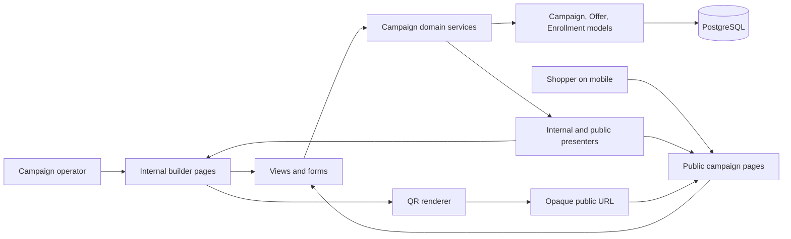
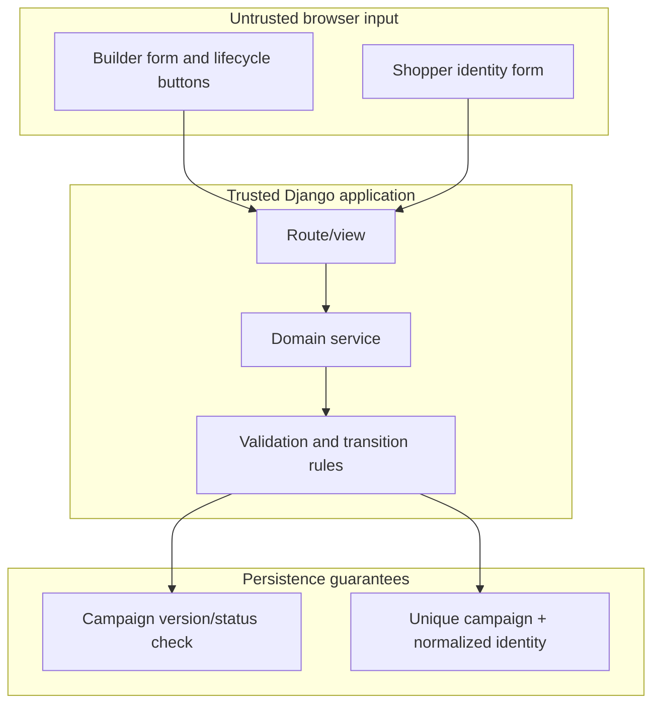
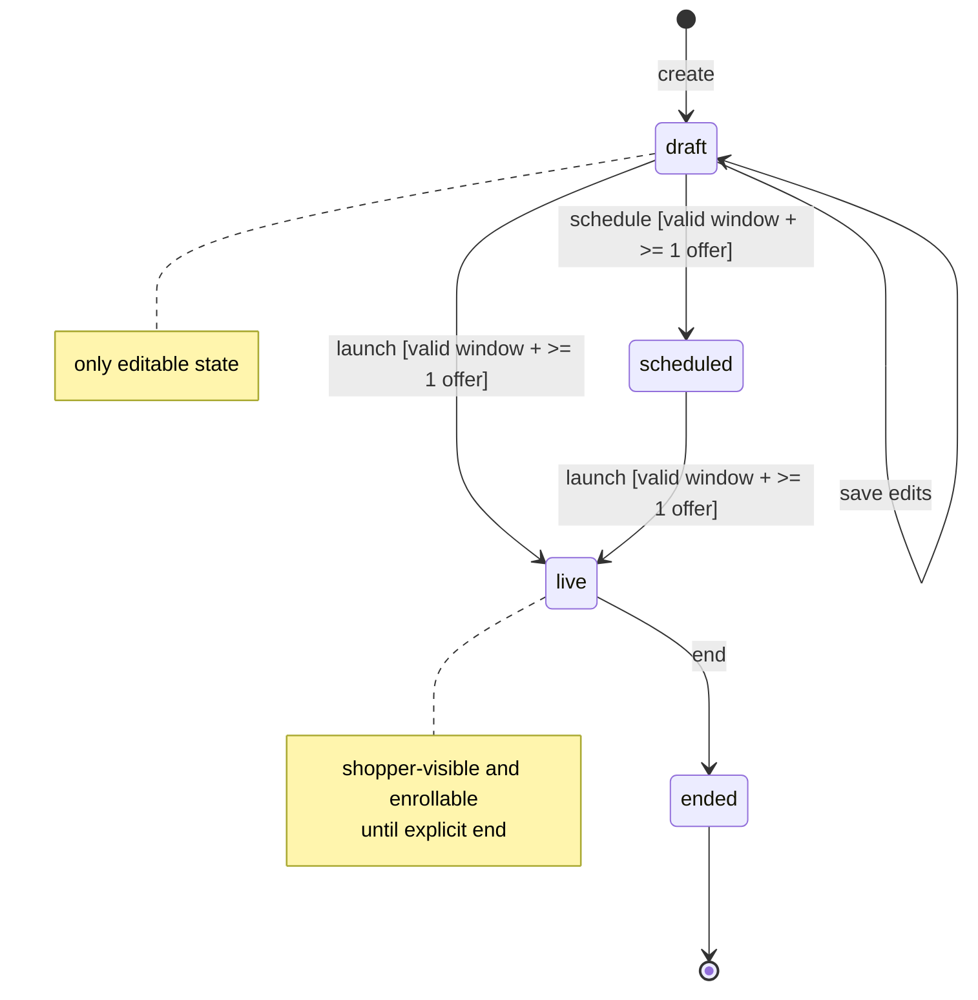
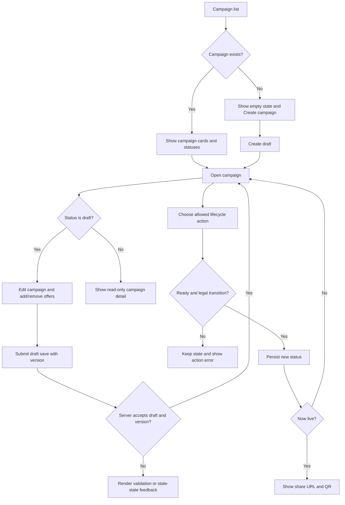
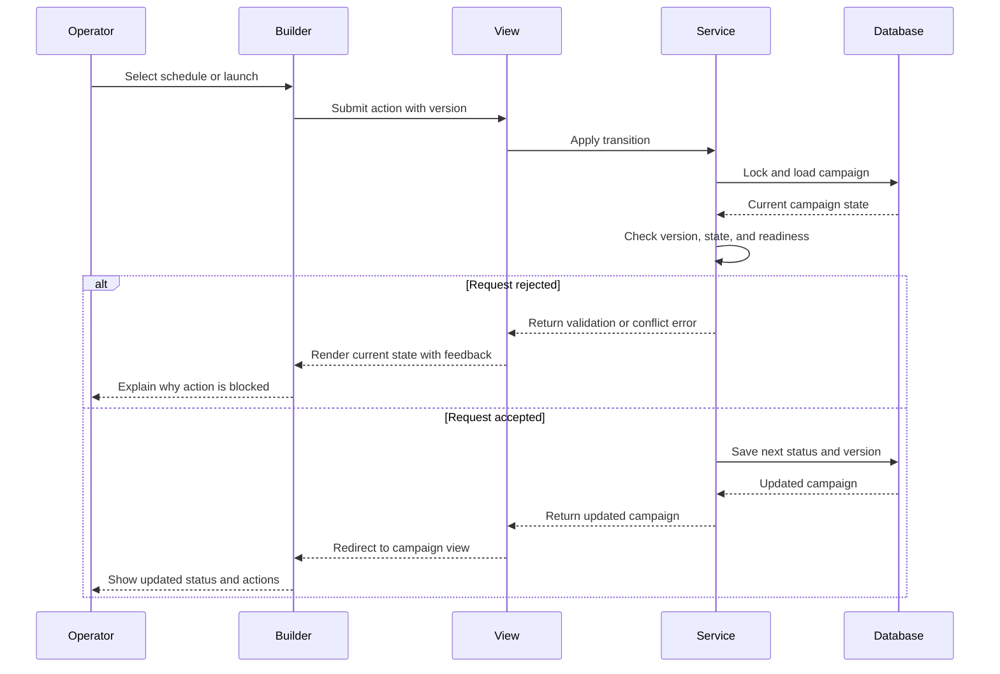
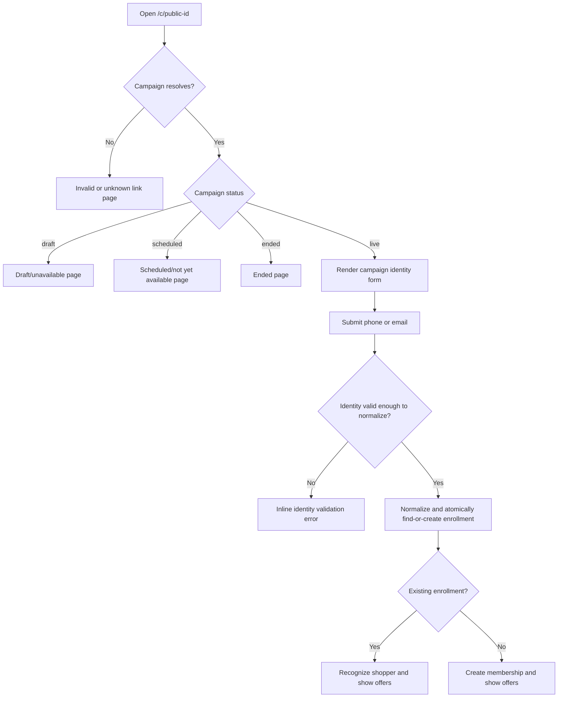
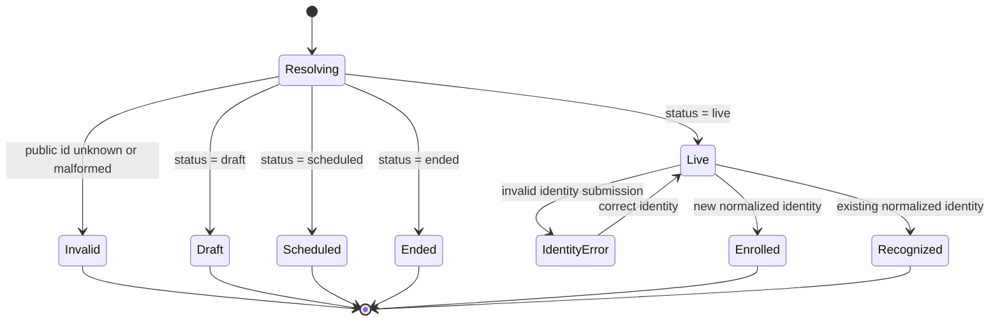
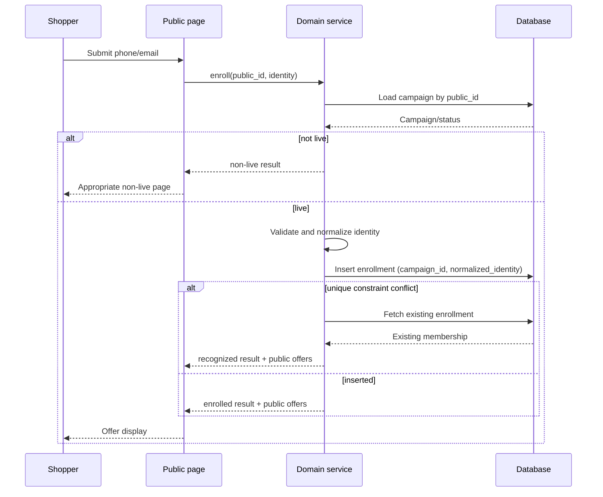
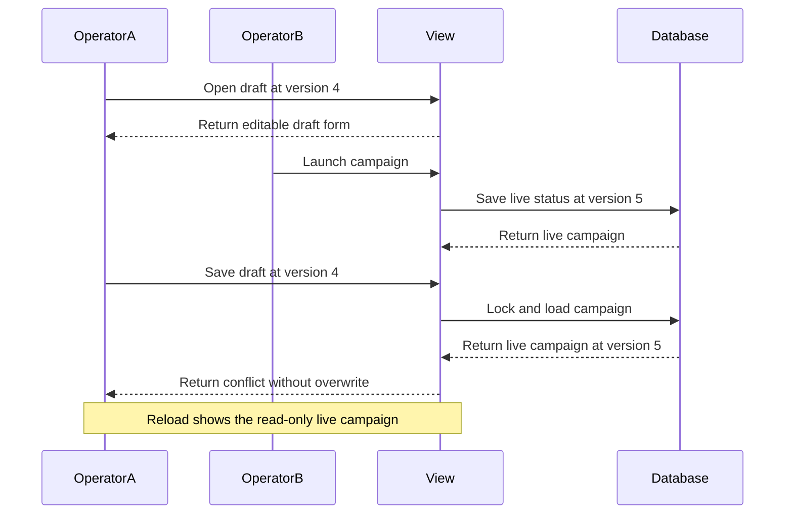
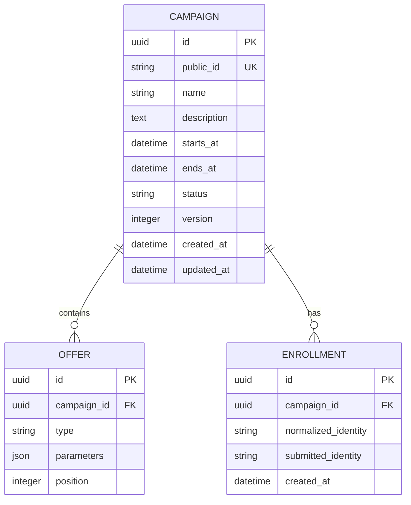

# LoopLink MVP — Solution Blueprint

This document turns the exercise into an implementation-ready, top-level design. It deliberately prioritises a dependable two-sided MVP over breadth.

## 1. Product boundary

There are two surfaces backed by the same campaign domain:

| Surface | Primary user | Goal | Authority |
|---|---|---|---|
| Internal builder | Campaign operator | Create, validate, transition, and distribute campaigns | Can mutate campaigns through server-checked actions |
| Shopper page | Shopper | Open a link, claim an identity, and view live offers | Can create/recognize an enrollment only for a live campaign |

The system is single-workspace and has no authentication. This means there are no tenant, account, role, OTP, coupon, or redemption concerns in the MVP.

## 2. Top-level system design

The final solution is a single Django application process with two server-rendered user interfaces. HTMX progressively enhances form submissions and state refreshes; it is not a second business-logic layer. All meaningful rules run in the domain-service boundary before the database is changed.

### Component responsibilities

| Component | Responsibility | Must not own |
|---|---|---|
| Internal builder templates/forms | Capture draft data, show allowed actions, render errors and distribution | Lifecycle authority or duplicate prevention |
| Public templates/forms | Resolve public states, collect identity, render offers | Knowledge of internal ids or edit actions |
| Views / HTMX actions | Translate HTTP requests to use cases and return pages/fragments | Business-rule duplication |
| Campaign domain services | Validate, transition status, prevent stale writes, normalize identities, enroll/recognize shoppers | HTML construction or request parsing |
| Models / database | Persist the campaign aggregate and enforce unique public id/enrollment identity | Deciding which UX message to render |
| Presenters | Map one domain model to safe internal or shopper-facing representations | Mutating domain state |
| QR renderer | Encode exactly the public URL | Business data, identities, or offer details |

### Boundary and trust model

The browser makes requests and can provide convenient feedback, but it is never authoritative for status, editability, campaign readiness, identity normalization, or enrollment uniqueness.

## 3. Scope priorities

### Must ship

| Area | Required capability | Acceptance signal |
|---|---|---|
| Builder list | List campaigns with their current status and a useful empty state | An operator can find every created campaign |
| Draft editing | Create and edit name, description, UTC window, and an ordered list of parameterised offers | Only a draft can be saved; each offer type displays and persists its required values |
| Lifecycle | Schedule, launch, and end with server-side legal-transition and readiness checks | Illegal calls fail even if the UI is bypassed |
| Distribution | For a live campaign, show its stable public URL and a scannable QR code | The QR resolves to the public page |
| Shopper page | Resolve a public link and render live, draft, scheduled, ended, or invalid states correctly | Offers are never exposed before live or after end |
| Enrollment | Accept phone or email, normalize it, record one membership per campaign/identity, and recognize repeats | Repeated enrollment does not create another record |
| Robustness | Validation, error, loading/empty, disabled actions, bad-link, non-live, and duplicate-recognition states | The important unhappy paths have usable feedback |
| Delivery | Setup documentation, technical notes, and automated coverage of the risky rules | A reviewer can run and exercise both surfaces |

### Good to have if it fits without reducing MVP quality

| Feature | Value | Recommended priority |
|---|---|---|
| Enrollment count in the builder | Demonstrates the connection between distribution and membership | First stretch goal |
| Accessible, polished mobile UI | Raises confidence in the shopper experience | Do throughout the MVP, but do not delay correctness |
| Keyboard-friendly forms and clear inline errors | Improves real-world usability | Do throughout the MVP |

### Explicitly optional / out of scope

| Item | Reason |
|---|---|
| Auto-launch / auto-end scheduler | Status, not time, is the visibility authority |
| Authentication, OTP, identity verification | The exercise intentionally uses a claimed identity |
| Coupon generation, offer execution, redemption | Enrollment only records membership and displays offers |
| SKU catalog validation, currencies, FX, minor units | `applies_to` and money values are display data in one implied currency |
| Pagination, multi-tenancy, horizontal scaling | Not needed for the single-process MVP |
| Live activity stream | Stretch only; polling/streaming is unnecessary for core flows |

## 4. Campaign lifecycle: the central state machine

Campaign status is the sole source of truth for shopper visibility and enrollment. Dates are validated readiness metadata; they never change status by themselves.

### Transition and edit policy

| Current status | Save edits | Schedule | Launch | End | Public outcome |
|---|---:|---:|---:|---:|---|
| `draft` | Yes | Yes, if ready | Yes, if ready | No | Not available |
| `scheduled` | No | No | Yes, if ready | No | Not available |
| `live` | No | No | No | Yes | Show identity form and offers after enrollment |
| `ended` | No | No | No | No | Show ended state, never offers |

`end` is implemented as `live → ended`. Its specified purpose is to close enrollment, which is open only for a live campaign; the exercise does not define draft or scheduled cancellation. This narrow interpretation is enforced and tested on the server rather than relying on the UI.

### Readiness rules shared by schedule and launch

`campaign_is_ready_to_publish` is true only when:

1. at least one offer exists;
2. both timestamps are present UTC datetimes;
3. `ends_at > starts_at`; and
4. the window is not already in the past at the transition request.

`launch` happens immediately even when `starts_at` is in the future. A live campaign remains live after `ends_at`; it stops only when ended explicitly.

## 5. End-to-end workflows

### Internal builder workflow

### Lifecycle action request sequence

This sequence applies to both schedule and launch; only their allowed source statuses differ.

### Shopper enrollment workflow

### Public-page rendering state

This is a request-time rendering state, not a persistent campaign lifecycle. It ensures a valid-but-non-live public link is distinguishable from a bad link.

### Enrollment request sequence

### Stale draft-save sequence

## 6. Domain model and invariants

| Entity | Essential fields | Required constraints |
|---|---|---|
| Campaign | internal `id`; opaque `public_id`; name; description; starts/ends; status; `version` or `updated_at` | `public_id` unique; status from enum; timestamps stored UTC |
| Offer | campaign FK; type; parameters; position | one of three catalog types; parameters valid for type; duplicate types allowed; preserve order |
| Enrollment | campaign FK; submitted identity; normalized identity; created timestamp | database unique constraint on `(campaign_id, normalized_identity)` |

### Offer contract

Use a typed application-level representation even if storage is a compact JSON field.

| Type | Parameter contract | Validation baseline | Shopper presentation |
|---|---|---|---|
| `PRODUCT_PERCENT_DISCOUNT` | `{ percent, applies_to }` | numeric `percent`; non-empty `applies_to` | “{percent}% off {applies_to}” |
| `CART_FIXED_DISCOUNT` | `{ amount_off, min_basket }` | numeric values | “{amount_off} off baskets of {min_basket}+” |
| `STICKER_EARN` | `{ stickers, per_amount }` | numeric values | “Earn {stickers} stickers per {per_amount} spent” |

Exact numeric bounds and copy are implementation choices; do not invent a product engine. The important contract is that every required parameter is entered, validated, stored, and rendered.

## 7. Interface and API boundary

Server-rendered pages plus HTMX actions fit the supplied Django starter. These are logical contracts; they can be HTML form routes instead of a separate JSON API. Domain services remain framework-independent so they are directly testable.

### Internal routes/actions

| Method | Route | Intent | Input | Success | Expected failure |
|---|---|---|---|---|---|
| `GET` | `/campaigns/` | List campaigns | — | list/empty page | — |
| `GET` | `/campaigns/new/` | Render create form | — | draft form | — |
| `POST` | `/campaigns/` | Create draft | campaign fields + offers | redirect/detail fragment | field errors |
| `GET` | `/campaigns/<id>/` | Detail/edit | — | status-aware view | 404 |
| `POST` | `/campaigns/<id>/` | Save draft | campaign fields + offers + `version` | updated draft | 409 stale/locked; 422 invalid |
| `POST` | `/campaigns/<id>/schedule/` | Draft → scheduled | optional expected version | updated status | 409 illegal/stale; 422 not ready |
| `POST` | `/campaigns/<id>/launch/` | Draft/scheduled → live | optional expected version | updated status/distribution | 409 illegal/stale; 422 not ready |
| `POST` | `/campaigns/<id>/end/` | Allowed current state → ended | optional expected version | updated status | 409 illegal/stale |
| `GET` | `/campaigns/<id>/distribution/` | Show live distribution | — | public URL + QR | 409 if not live |

### Public routes/actions

| Method | Route | Intent | Input | Success | Expected failure |
|---|---|---|---|---|---|
| `GET` | `/c/<public_id>/` | Resolve campaign public state | opaque public id | appropriate public page | 404 invalid/unknown link |
| `POST` | `/c/<public_id>/enroll/` | Enroll/recognize shopper | `identity` | offers + enrolled/recognized result | 422 identity invalid; 409 non-live |

### Representation boundary

| Concern | Internal representation | Public representation |
|---|---|---|
| Campaign status | Exact status and permitted actions | Only the state-specific shopper message |
| Dates | Full UTC start/end values and validation details | Do not use to determine availability; display only if product copy needs it |
| Offers | Editable types, raw parameters, positions | Formatted offer copy and values, only when live |
| Identity/enrollment | Count and operational state if stretch selected | Submitted identity is not echoed unnecessarily; result is enrolled/recognized |
| Identifiers | Internal primary key and public id | Opaque public id only |

The distribution link should be `/c/<opaque-public-id>/`. It contains no campaign name, status, offer parameters, identity, signature material, or expiry. The server resolves it and decides what, if anything, to show.

## 8. Validation, concurrency, and error contract

### Validation ownership

The server is authoritative. The browser may mirror required fields and simple numeric/date constraints for quick feedback, but it must consume the same field names and error shapes as the server. Lifecycle readiness and status permission live in one domain service to prevent drift.

| Rule | Client feedback | Server enforcement |
|---|---|---|
| Required campaign/offer inputs | Yes | Yes |
| Offer parameter types | Yes | Yes |
| Window ordering/past check | Yes | Yes |
| Draft-only editing | Disable form / read-only UI | Yes |
| Legal lifecycle action | Hide/disable unavailable actions | Yes |
| Live-only enrollment | Do not render form otherwise | Yes |
| Identity normalization and dedup | Basic feedback | Yes, plus database unique constraint |

### Stale draft protection

Include `version` (preferred) or `updated_at` in the edit form. On save, lock/load the campaign and require both:

1. status is still `draft`; and
2. submitted version equals persisted version.

Otherwise return a conflict response explaining that the campaign changed or is now locked; do not overwrite it. A successful mutation increments `version` atomically.

### Error vocabulary

| Situation | HTTP/form outcome | UI response |
|---|---|---|
| Bad field/offer/window input | 422 | Field-level error and preserve entered data |
| Illegal state action | 409 | Refresh status/actions and explain why it is unavailable |
| Stale draft save | 409 | Do not save; tell operator to reload the locked/current campaign |
| Invalid/unknown public id | 404 | “This campaign link is invalid” page |
| Known non-live public campaign | 200 | Draft, scheduled, or ended page without offers |
| Invalid identity | 422 | Inline identity validation |
| Repeat enrollment | 200 | Recognized result and same offer display |
| Race during enrollment | 200 after unique-conflict recovery | Recognized result, never a duplicate/error to shopper |

## 9. Recommended implementation slices

Build in this order so each slice leaves a demonstrable product:

1. **Foundation:** campaign/offer/enrollment models, migrations, status enum, opaque public id, and domain services.
2. **Draft builder:** list/empty state, create, edit, typed offer input, and server validation.
3. **Lifecycle:** schedule/launch/end actions, ready checks, version handling, and read-only state.
4. **Public distribution:** public resolution, non-live pages, live page, enrollment normalization/dedup, formatted offers.
5. **Distribution UI:** stable share link and QR for live campaigns.
6. **Confidence:** focused tests, README flows, and TECH_NOTES decisions/cuts.
7. **One stretch only if time remains:** enrollment count or extra frontend craft.

## 10. Test matrix: non-negotiable behaviours

| Test group | Cases |
|---|---|
| Lifecycle | draft can schedule/launch when ready; schedule fails without offer or valid window; scheduled can launch; illegal backward/repeated transitions fail; end closes enrollment |
| Draft locking | non-draft save fails; stale version cannot overwrite a changed/transitioned campaign |
| Offer validation | each type rejects missing/invalid required parameters; multiple offers of same type persist |
| Public resolution | unknown id is invalid; draft/scheduled/ended never expose offers; live exposes identity form |
| Enrollment | email case/space normalization; phone punctuation/space normalization; first enrollment created; repeat recognized; DB uniqueness covers a race |

## 11. Design decisions to record in `TECH_NOTES.md`

The eventual technical notes should directly answer the review prompts:

1. Server-authoritative validation with optional client mirroring.
2. Explicit lifecycle transition map in a service, with the UI derived from current status.
3. Optimistic concurrency using `version` and a draft-only write check.
4. Opaque stable public id in the QR/link; status remains server-resolved.
5. Minimal identity validation, deterministic normalization, and `(campaign, normalized_identity)` uniqueness.
6. Separate internal and public presenters/serializers/templates over one domain model.
7. Intentional cuts: no scheduler, auth, offer execution, redemption, analytics/live stream, or multi-tenant scaling.

## 12. Completion checklist

- [ ] Every required field and offer parameter can be entered and displayed.
- [ ] Server rejects every illegal edit, lifecycle action, and non-live enrollment.
- [ ] Public status is determined only from stored campaign status, never date comparison.
- [ ] QR opens the same stable public URL shown to the operator.
- [ ] Duplicate enrollment is impossible at database level and friendly at UI level.
- [ ] A stale draft cannot overwrite a now-launched/ended campaign.
- [ ] README covers setup plus one blocked launch and one non-live scan.
- [ ] TECH_NOTES explains the six requested decisions, AI use, cuts, and next steps.
